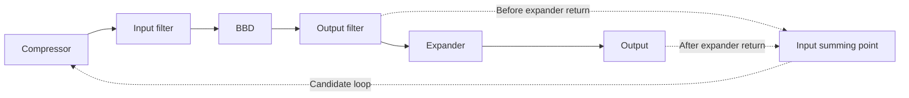

# M2.5: 570/571 compander modeling and qualification

This milestone adds internal, separate feedback compressor and feedforward
expander components. Production still uses `DigitalFractionalDelay`. The
qualification shell is `BBDCompanderQualificationChain`; no plugin parameters,
production routing, UI, presets or musical feedback were added. The branch starts
at merged M2.4 (`ff7488c`).

## Source and equations

**PAPER-BACKED:** Raffel/Smith, supplied `bbd modeling (1).pdf`, PDF pp.4-5,
sections 3.1-3.4, describes two variable gain amplifiers with separate level
averagers. One half is a feedback compressor and the other a feedforward
expander, nominal ratio 2. Full-wave rectification and an external capacitor
with approximately 10 kohm internal resistance determine the detector.

```
tau = R * Crect                         R = 10000 ohms
alpha = dt / (tau + dt)
beta  = tau / (tau + dt)
L[n] = alpha * abs(signal[n]) + beta * L[n-1]

compressor: y[n] = x[n] / avg(abs(y[n]))
expander:   z[n] = avg(abs(y[n])) * y[n]
```

The expander's input is the signal it actually receives, after its channel. Its
detector is a separate state object. `CompanderLevelAverager::processMagnitude`
accepts seconds explicitly; no block-rate updates, RMS detector, dB-domain
compressor, attack/release split, threshold, knee, lookahead, makeup or limiter.
Nominal capacitors .22/.47/1 uF give 2.2/4.7/10 ms. Qualification also uses
.01/10 uF (0.1/100 ms), labeled **ENGINEERING / OUTSIDE TYPICAL PAPER RANGE**.
Resistance defaults to 10000 ohms; other values are engineering experiments.
No final musical capacitor has been selected.

## Feedback solution and numerical policy

**DERIVED FROM PAPER EQUATIONS:** Let `b=beta*Lprev` and substitute
`abs(y)=abs(x)/L` into the current-sample RC recurrence:

```
L = alpha*abs(x)/L + b
L^2 - b*L - alpha*abs(x) = 0
L = (b + sqrt(b*b + 4*alpha*abs(x))) / 2
y = x/L
```

For positive input magnitude the other root is negative. At zero input the
nonnegative continuation is `L=b`. The positive sum avoids subtractive
cancellation. No Newton iteration, previous-sample gain approximation or
instantaneous square-root waveshaper is used. Tests independently bisect the
long-double residual equation, compare RC updates to long-double arithmetic,
and compare steps to `1-beta^n`.

**ENGINEERING APPROXIMATION:** Both detectors reset independently to unity in
dimensionless normalized units. For a cold first sample with `abs(x)<=1`, the
compressor magnitude does not exceed unity except floating-point rounding.
`L=max(L,2^-500)` prevents the silence singularity. This binary floor is about
3.055e-151; its square `2^-1000` is a normal double and its reciprocal `2^500`
is finite. The steady-state DC crossover is `abs(x)=2^-1000`, about -6021 dB
normalized. This is a numerical boundary, not an audible gate or a chosen IC
threshold. There is no separate gain ceiling or audio limiter. At the floor,
audio remains linear with `y=x/floor`; the mapping joins the positive-root
branch continuously. Double subnormal input is flushed to zero. Nonfinite
input becomes zero and finite input is admitted within the existing core's
float-magnitude boundary. Intermediate/output calculations remain double.
Expander products can exceed float max during standalone extreme tests, but
remain finite doubles; no silent clipping is performed there.

Subnormal arithmetic contributions and subnormal final outputs are explicitly
flushed before their multiply/divide operations. The fast check uses 2^-450:
two operands above that bound have a normal product, so normal audio incurs no
underflow-boundary division. In the numerical tail, a product below the minimum
normal double contributes zero. This is an **ENGINEERING APPROXIMATION**, not a
different RC law. In the supported host/event timebases, dropped quadratic terms
are below 2.23e-308 apiece, compared
with the floor square 9.33e-302; any relative detector perturbation is confined
to the extreme floor neighborhood, far below the qualified -80 dB range. Normal
tail products (e.g. .5e-300) remain intact. Subnormal compressor division results
are detected from their numerator/denominator bound before dividing; sign is
preserved when returning zero.

Configuration validation uses finite capacitance 1e-12..1e-3 F, resistance
1..1e6 ohms and floor 2^-500..1. Invalid settings fall back to nominal values.
These are engineering numerical limits. No independent attack/release constants
exist. Invalid/nonpositive detector intervals hold state. Core preparation
normalizes invalid host rates through the existing M2.4 policy.

After prolonged silence, the compressor can produce an internal RC gain surge:
with a nearly zero detector, `abs(y) ~= sqrt(abs(x)/alpha)`. Unity initialization
does not eliminate this later physical-model transient. Matched ideal expansion
cancels it; filters and nonlinear overload can alter it. The sample-by-sample
transient artifact exposes this behavior instead of suppressing it with a hidden
limiter. This is a limitation of the normalized ideal circuit, particularly
before physical voltage/headroom calibration.

## Topology and timing

Implemented qualification topology:


**ENGINEERING APPROXIMATION:** `OutsideFilters` runs both continuous input/output
observations at the host sample interval. The compressor supplies the weighted
host impulses already used by the input filter; the expander receives the
reconstructed host observation. Detector timing is independent of BBD clock.
The core's scheduler, capture, transfer, filter transitions and noise progression
retain M2.4 timing. Instrumentation exists only under `DRIFT_BBD_INSTRUMENT`.

**PAPER-BACKED:** The paper does not establish a universal filter/feedback
placement. `BBDTerminals` is deferred: a nonlinear compressor on an input
continuous-time filter needs event-time integration and an expander preceding
output reconstruction needs a held/event-time detector definition. The dt API
supports investigating those cases later; a host-rate substitute would change
their meaning.

Possible feedback placements, **not implemented or selected**:



These are qualification candidates, not interchangeable models of a specific
pedal. Main acceptance does not select a musical feedback topology.

## Measurement definitions and findings

The generated `README.txt` specifies stimuli, windows, seeds and schemas. All
default measurements use 48 kHz. Analytical ratios use DC settled for 100 tau
at -80/-70/-60/-50/-40/-30/-24/-18/-12/-6/0 dB, compared directly to `sqrt(A)`
and `A^2`, as well as adjacent local slopes. A separate 0.25 Hz sine measures
low-frequency RMS, without mistaking detector ripple for a DC slope.

**DERIVED FROM PAPER EQUATIONS:** DC compressor and expander slopes are .5 and
2. Their normalized gains are amplitude-dependent; for sinusoids the rectified
mean and ripple influence normalization. No voltage calibration or makeup gain
is implied.

For an ideal unity channel, identical parameters and initial states imply
`Lexp[n]=Lcomp[n]` because the expander observes exactly the compressor output.
Thus instantaneous roundtrip identity is the mathematical expectation, within
rounding, for DC, sine, amplitude steps, slow ramps, tone bursts, AM, synthetic
program, impulses and rhythmic envelopes. Measured peak/RMS/gain/DC and residual
bins are exported. `recovery_first_sample_after_transition=0` denotes that the
full trajectory, including transition samples, stays below the 2e-12 peak bound.
That result does not promise transparent transient behavior around a filtered,
noisy, nonlinear or time-warped BBD.

Ripple measurements use .25-amplitude sines at 20/50/100/200/500/1000 Hz, .5 s
settling and a coherent 1 s window. Each row includes detector mean, peak-to-peak
ripple, ripple/mean and `(gmax-gmin)/(gmax+gmin)` gain modulation. Reference,
compressor-output and expander-input detectors are separate rows. Low-frequency
ripple is substantial even at nominal capacitors; no claim that these component
values completely reject 20 Hz waveform ripple is made.

Transient rows record every sample of .5 s: silence to -24/0 dB, -40 to -6 dB,
-6 to -40 dB, a tone burst and alternating loud/quiet bursts. Rectified
compressor output, both detectors, both gains and final output are included.
These are RC trajectories, not studio-compressor attack/release measurements.

Noise qualification uses the deterministic M2.2 noise source (output RMS 1e-4,
seed 991, 1024 stages, 10 ms) at -60/-48/-36/-24/-12/-6/0 dB. Each noisy path
has an otherwise identical noise-free paired render. The RMS of their difference
measures incremental noise including noise-driven detector changes; clean RMS
defines signal power. This avoids misreporting deterministic distortion as
stochastic noise. No-compander, compressor-only and full-compander cases are
separate. Noise-induced expander gain difference and total modulation depth are
both exported. IC noise/distortion and calibrated device SNR remain deferred.

Nonlinearity cases A-E compare linear/no compander, nonlinear/no compander,
linear/compander, nonlinear/compander and full character/nonlinear/compander.
The M2.4 polynomial coefficients and extension are unchanged. Actual capture
events accumulate input peak/RMS/mean rectified magnitude and fractions in
`abs(x)<=1` (nominal polynomial domain) and `.1<=abs(x)<=1` (engineering
observation band). A host-rate RC detector additionally observes the held input
tap. Nonlinear-only output taps are held at output events; incremental nonlinear
H2-H5 are measured from the difference between nonlinear output and its input,
normalized to input H1. These include hold observation effects, not an IC fit.
Output H2-H5 and THD come from clean renders; noise uses the paired difference.
Companding raises weak signals inside the BBD, but also increases the generated
cubic distortion and can exceed its nominal domain at high input levels.
Noise reduction is not evidence of a better distortion calibration.

Delay/envelope qualification uses impulses, tone bursts, amplitude steps and
rhythmic envelopes at 3/10/30/100/300 ms (1024 stages, within the core limits).
Analysis searches +/-16 samples around physical delay. Alignment is applied
only to the measurement reference; no sidechain is delayed. The expander
observes its own received signal. Both unfiltered transport and filtered paths
are measured. At 300 ms the sampling clock is 1706.7 Hz, so 500 Hz signal
harmonics can alias. Filter response and time sampling contribute to error;
these are not all detector misalignment.

Clock tests cover constant delay, sinusoidal modulation, deterministic
raised-cosine random modulation and an abrupt 10-to-3 ms switch. Cache-only
compressor/expander detector, bucket and phase changes are exactly zero.
Per-sample audio/gain/envelope differences are exported separately: a physical
clock change can produce transport and filter transients. No detector reset,
bucket reset, nonlinear reconfiguration or extra sidechain occurs.

Stereo qualification uses independent L/R compressor and expander states with
asymmetric levels, different tones and alternating balance. Ideal-channel
balance and correlation are conserved within rounding; Table1/BBD results
include frequency response and delay. No linked detector or production stereo
policy was selected.

## Performance, regression and artifacts

### Native Windows Release measurements

Measured with GCC/MinGW Release on this workspace; these are fixture results,
not device specifications. DC local slopes differ from .5/2 by less than 1e-9;
analytical output level error is below 1e-8 dB. Across all controlled ideal-channel
signals and five capacitors, maximum peak error is 6.22e-15, maximum RMS error
1.05e-15. Transient gain errors stay at floating-point scale.

Reference detector ripple/mean (peak-to-peak):

| Capacitor | 20 Hz | 50 Hz | 100 Hz | 200 Hz | 500 Hz | 1000 Hz |
|---|---:|---:|---:|---:|---:|---:|
| .22 uF | 1.2283 | .7882 | .4507 | .2347 | .0951 | .0478 |
| .47 uF | .8750 | .4256 | .2207 | .1114 | .0447 | .0225 |
| 1 uF | .4921 | .2079 | .1049 | .0525 | .0211 | .0106 |

At .47 uF, full-compander SNR improvements over no compander are
31.87/25.87/19.87/13.87/7.87/4.87/1.87 dB for inputs
-60/-48/-36/-24/-12/-6/0 dB. Their absolute SNRs are
53.48/59.48/65.48/71.48/77.48/80.48/83.48 dB in this fixture.

At -60 dB the captured BBD RMS rises from .0006826 to .02704 (39.6 times);
output H2-H5 THD rises from .00602% for nonlinear/no compander to .2429% for
nonlinear/compander. At -24 dB, useful observation-band occupancy rises from
0% to 78.91%; THD rises from .3797% to 1.929%. At 0 dB, nonlinear/compander
THD is 8.223% and only 56.64% of captures lie inside the nominal abs<=1
polynomial range. This model increases weak-signal distortion rather than
making it disappear; it does not reproduce a calibrated amplitude-independent
IC THD curve.

Following 200 ms silence, a DC step to unity produces compressor internal peaks
10.32/15.05/21.93 at .22/.47/1 uF. Matched ideal expansion restores unity with
peak deviation below 1e-14 in these sample traces. The compressor detector first
remains within 1% of its DC steady state after approximately
4.375/9.271/19.646 ms on upward steps, and
8.625/18.375/39.063 ms on -6 to -40 dB transitions. These are detector settling
observations of the same RC law, not separately tuned attack/release constants.

For filtered tone bursts, best-reference lags at 3/10/30/100/300 ms are
149/485/1445/4804/14404 samples; RMS errors are
.02807/.02815/.02854/.03356/.06719. This includes input/output filtering,
sample/hold error, envelope normalization and onset behavior. The corresponding
unfiltered RMS errors are .00547/.00561/.00841/.02311/.07063.
Clock cache-only detector jumps remain exactly zero. Independent stereo ideal
balance changes stay below 4e-15 dB; filtered different-tone balance change is
.06392 dB and alternating-balance change is -.01849 dB. The largest correlation
change among the tested filtered cases is .001085.

Full character+nonlinear+compander stereo wall/audio factors span
.00861-.05784; eight-core factors span .03473-.22837. Full-compander-only
overhead over matching M2.4 spans .03%..16.73% stereo and -.95%..16.33%
eight-core. Full-character matching comparisons span -.97%..16.52% stereo
and -1.28%..16.32% eight-core. Negative short-window estimates indicate timing
noise rather than a promised optimization. Detector updates for full companding
are 192000/s stereo and 768000/s eight-core; compressor and expander each use
half that count.

Eight-core full-character wall/audio factors (lower is better):

| Stages | 3 ms | 10 ms | 30 ms |
|---|---:|---:|---:|
| 512 | .15115 | .08214 | .03473 |
| 1024 | .16024 | .14578 | .05835 |
| 2048 | .18401 | .15204 | .10715 |
| 4096 | .22837 | .16554 | .14898 |

Stereo and eight-core measurements cover 512/1024/2048/4096 stages and
3/10/30 ms. Cores are sequential independent DSP instances, not worker threads.
Each timing uses .25 s audio after .25 s warmup, median of three. The CSV includes
wall/audio factor, analytically counted detector/compressor/expander updates
per audio second and overhead against M2.4. Full character comparisons also
include a matching M2.4 full-character/nonlinear baseline, so its additional
cost is distinguished from compander overhead. Absolute timing includes async
qualification counters; production builds omit them. Event operating-stat
collection is disabled during timing. Short wall timings are noisy and are
informational, never CI gates.

The M2.4 housekeeping removes its permanent `nonlinearEvaluations` increment;
qualification counts derive from `totalOutputCount` when the nonlinear element
is enabled. Its misleading CSV name becomes `cpu_factor_vs_stereo_baseline`.
Frozen M2.4 core, character, nonlinear transfer, filters and math dependencies
are retained in `tests/reference_m24` with only namespace/macro renaming. Tests
compare output bits, held value, bucket memory, filter observation, scheduler
phase and event counts with active deterministic noise and nonlinearity, under
fixed and modulated clocks. Noise-inclusive output identity verifies RNG
progression. Tests cover long silence/DC, all magnitude decades through float
max, invalid/subnormal signals, maximum event rates, 256-4096 stages, and exact
output/detector trajectories for block sizes 1/17/64/127/256/511/1024.
Ordinary C++ heap allocations are zero across processing and clock changes;
processing code contains no locks, exceptions or allocation calls. `prepare`
allocates buckets outside processing. The detector itself never allocates.

Build/run:

```
cmake -S . -B build -DDRIFT_BUILD_PLUGIN=OFF -DCMAKE_BUILD_TYPE=Release
cmake --build build --parallel 2
ctest --test-dir build --output-on-failure
./build/drift_bbd_compander_qualification artifact
```

All existing CI jobs are preserved. Always-run CTest adds mathematical/numerical
and artifact stream safety tests; the existing Linux ASan/UBSan job exercises
them. The dedicated `bbd-compander-qualification` job uploads
**DriftBrigade-M2.5-BBD-Compander-Qualification**, containing the twelve requested
CSVs and README. Open, initial flush, final flush and close are checked using the
existing fail-safe tests, including `/dev/full` on Linux. Native Windows Release
tests pass; this machine has no Linux WSL distribution and lacks the native
MinGW ASan runtime. Linux sanitizer acceptance comes from CI, not a simulated
local claim.

## Deferred work and next milestone

Still deferred: final capacitance/subjective tuning, gain calibration in volts,
commercial pedal calibration, compander IC noise/distortion, clock feedthrough,
terminal/filter alternative, musical feedback selection, feedback limiter,
production BBD routing/stage count/stereo policy, user parameters, UI, presets
and M1.1 subjective selections. The normalized ideal model is not a transistor
or measured IC simulation, and the M2.2/M2.4 synthetic fixtures remain engineering
approximations. Extreme overload safety is not calibrated audio headroom.

Recommended next milestone: physical gain/headroom normalization and explicit
topology qualification, with voltage-referenced operating levels and a clean
event-time definition for any terminal placement. This should precede choosing
musical feedback or exposing a production BBD mode.
